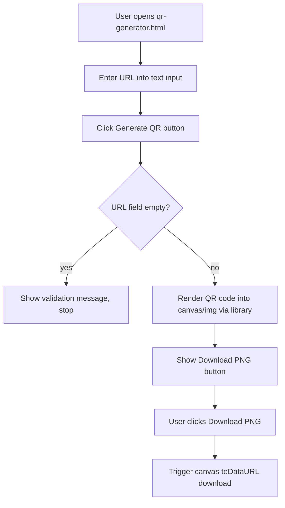

# Design Document: QR Video Player

## Overview

A zero-dependency, static-file web application consisting of two pages:

- `video.html` — the video playback page users land on after scanning a QR code
- `qr-generator.html` — an admin page for generating and downloading QR codes

The application is intentionally minimal: pure HTML, CSS, and Vanilla JavaScript with no build toolchain, no framework, and no server-side component. All configuration lives in a single `CONFIG` object at the top of `script.js`. The only permitted external dependency is one lightweight QR library loaded via CDN on the generator page.

Design goals:
- Instant load on mobile networks (no frameworks, metadata-only preload)
- Privacy-first (no analytics, no tracking, no third-party iframes)
- Operator-friendly (edit one `CONFIG` object to deploy for a new event)
- Statically hostable on Cloudflare Pages, GitHub Pages, Netlify, or Vercel with zero build steps

---

## Architecture

The project is a flat static file structure — no bundler, no transpiler, no module graph beyond what the browser handles natively.

```
project-root/
├── index.html          # Redirect or landing page
├── video.html          # Video playback page
├── style.css           # Shared styles
├── script.js           # Video page logic + CONFIG object
├── qr-generator.html   # QR code admin page
├── qr-generator.js     # QR generator logic
├── assets/             # Optional: logo images, favicon
└── README.md
```

### Runtime flow — Video Page

```mermaid
flowchart TD
    A[User scans QR code] --> B[Browser loads video.html]
    B --> C[script.js reads CONFIG]
    C --> D[Set video.src = CONFIG.videoUrl]
    D --> E[Show Loading_Screen]
    E --> F{Player fires event}
    F -->|canplay| G[Hide Loading_Screen]
    F -->|error| H[Hide Loading_Screen, Show Error State]
    G --> I{CONFIG.autoplay?}
    I -->|false| J[Show Play_Overlay]
    I -->|true| K[Call video.play()]
    K --> L{Autoplay succeeds?}
    L -->|yes| M[Hide Play_Overlay, play]
    L -->|no, browser blocked| J
    J --> N[User taps Play_Overlay button]
    N --> M
```

### Runtime flow — QR Generator Page



---

## Components and Interfaces

### Video Page (`video.html` + `script.js`)

#### CONFIG Object

Defined at the top of `script.js`. All deployable configuration lives here.

```js
const CONFIG = {
  videoUrl: "https://example.com/video.mp4",
  title: "Event Video",
  autoplay: true,
  muted: true,
  loop: false,
  showBranding: true,
  organizationName: "Acme Corp",
  logoUrl: "assets/logo.png"
};
```

#### DOM Components

| Component | Element | Role |
|---|---|---|
| Player | `<video id="player">` | Native HTML5 video, always has `controls`, `playsinline`, `preload="metadata"`, `title` |
| Loading_Screen | `<div id="loading-screen">` | Full-viewport overlay, shown on load, hidden on `canplay` or `error` |
| Play_Overlay | `<div id="play-overlay">` | Centered tap-to-play button, shown when autoplay blocked |
| Error_State | `<div id="error-state">` | Error message + Retry button, hidden by default |
| Branding_Block | `<div id="branding">` | Optional org name + logo, visibility controlled by `CONFIG.showBranding` |

#### JavaScript Functions (`script.js`)

| Function | Responsibility |
|---|---|
| `initPlayer()` | Reads CONFIG, sets `video.src`, applies attributes, attaches event listeners |
| `showLoadingScreen()` / `hideLoadingScreen()` | Toggles Loading_Screen visibility |
| `showPlayOverlay()` / `hidePlayOverlay()` | Toggles Play_Overlay visibility |
| `showErrorState()` / `hideErrorState()` | Toggles Error_State visibility |
| `handleAutoplay()` | Calls `video.play()`, catches rejection, shows Play_Overlay if blocked |
| `handleRetry()` | Resets `video.src` to trigger a fresh load without page refresh |
| `initBranding()` | Conditionally renders Branding_Block content based on CONFIG |

### QR Generator Page (`qr-generator.html` + `qr-generator.js`)

#### DOM Components

| Component | Element | Role |
|---|---|---|
| URL Input | `<input type="url" id="url-input">` | User-entered URL |
| Generate Button | `<button id="generate-btn">` | Triggers QR rendering |
| QR Container | `<div id="qr-container">` | Hosts the rendered QR code canvas/image |
| Validation Message | `<p id="validation-msg">` | Empty-input feedback |
| Download Button | `<button id="download-btn">` | Saves QR code as PNG |

#### JavaScript Functions (`qr-generator.js`)

| Function | Responsibility |
|---|---|
| `generateQR()` | Validates input, calls QR library, renders into container |
| `downloadQR()` | Converts canvas to data URL, triggers download as `.png` |

#### QR Library Selection

**qrcode.js** (davidshimjs/qrcodejs) or **QRCode.js** via jsDelivr CDN — both are MIT-licensed, ~20 KB, client-side only, no data leaves the browser.

Preferred: `https://cdn.jsdelivr.net/npm/qrcode@1.5.3/build/qrcode.min.js` (QRCode npm package) — well-maintained, supports canvas output, no external calls.

---

## Data Models

### CONFIG (runtime, not persisted)

```typescript
interface Config {
  videoUrl: string;           // Direct HTTPS URL to .mp4/.webm/.ogg file
  title: string;              // Page <title> and video element title attribute
  autoplay: boolean;          // Whether to attempt autoplay on load
  muted: boolean;             // Whether the video starts muted
  loop: boolean;              // Whether the video loops
  showBranding: boolean;      // Whether to render the Branding_Block
  organizationName: string;   // Text displayed in Branding_Block
  logoUrl: string;            // URL for logo image; empty string = no logo rendered
}
```

### Player State (in-memory, not persisted)

```typescript
type PlayerState =
  | "loading"     // Loading_Screen visible, awaiting canplay/error
  | "ready"       // canplay fired, autoplay will be attempted
  | "playing"     // video.play() resolved
  | "paused"      // play overlay shown (autoplay blocked or user paused)
  | "error";      // error event fired, Error_State visible
```

### QR Generator State (in-memory, not persisted)

```typescript
interface QRState {
  inputUrl: string;       // Current value of the URL input
  qrRendered: boolean;    // Whether a QR code is currently shown
  validationError: string | null; // Non-null when validation fails
}
```

---

## Correctness Properties

*A property is a characteristic or behavior that should hold true across all valid executions of a system — essentially, a formal statement about what the system should do. Properties serve as the bridge between human-readable specifications and machine-verifiable correctness guarantees.*


### Property 1: Video source matches CONFIG

*For any* valid `CONFIG.videoUrl` value, after `initPlayer()` runs, the video element's `src` attribute (or `currentSrc`) must equal `CONFIG.videoUrl`.

**Validates: Requirements 1.1, 2.3**

### Property 2: Autoplay attributes applied when CONFIG.autoplay is true

*For any* `CONFIG` object where `autoplay` is `true`, after `initPlayer()` runs, the video element must have both the `autoplay` and `muted` attributes present.

**Validates: Requirements 2.4**

### Property 3: Loop attribute applied when CONFIG.loop is true

*For any* `CONFIG` object where `loop` is `true`, after `initPlayer()` runs, the video element must have the `loop` attribute present.

**Validates: Requirements 2.5**

### Property 4: Autoplay attempt on CONFIG.autoplay true

*For any* `CONFIG` where `autoplay` is `true`, `initPlayer()` must call `video.play()`. If the call resolves, the Play_Overlay must remain hidden. If the call rejects (browser blocked), the Play_Overlay must be shown.

**Validates: Requirements 3.1, 3.2, 3.3**

### Property 5: Play_Overlay tap triggers playback and hides overlay

*For any* state where the Play_Overlay is visible, activating the Play_Overlay button must call `video.play()` and hide the Play_Overlay.

**Validates: Requirements 3.4**

### Property 6: canplay event hides Loading_Screen

*For any* video load sequence, when the player fires `canplay`, the Loading_Screen must transition from visible to hidden.

**Validates: Requirements 4.2**

### Property 7: error event triggers error state

*For any* video load sequence, when the player fires `error`, the Loading_Screen must be hidden and the Error_State (including error message, sub-message, and Retry button) must be visible.

**Validates: Requirements 4.3, 5.1, 5.2, 5.3**

### Property 8: Retry resets video source without full page reload

*For any* error state, clicking the Retry button must reassign `video.src` to `CONFIG.videoUrl` and must not call `window.location.reload()` or navigate away.

**Validates: Requirements 5.4**

### Property 9: Branding visibility matches CONFIG.showBranding

*For any* `CONFIG` object, after `initBranding()` runs, the Branding_Block must be visible if and only if `CONFIG.showBranding` is `true`.

**Validates: Requirements 7.1, 7.2**

### Property 10: Logo image rendered if and only if logoUrl is non-empty

*For any* `CONFIG` object, after `initBranding()` runs, the Branding_Block must contain an `` element if and only if `CONFIG.logoUrl` is a non-empty string.

**Validates: Requirements 7.3, 7.4**

### Property 11: organizationName text appears in Branding_Block

*For any* `CONFIG.organizationName` string and `CONFIG.showBranding` true, after `initBranding()` runs, the Branding_Block's text content must include `CONFIG.organizationName`.

**Validates: Requirements 7.5**

### Property 12: QR code rendered for any non-empty URL input

*For any* non-empty URL string entered into the QR Generator's URL input field, clicking Generate must result in a QR code element being rendered in the QR container.

**Validates: Requirements 9.3**

### Property 13: Empty URL input prevents QR generation

*For any* state where the URL input is empty (including whitespace-only), clicking Generate must not render a QR code and must display a validation message.

**Validates: Requirements 9.7**

### Property 14: CONFIG.videoUrl must be an HTTPS URL

*For any* deployed CONFIG, `CONFIG.videoUrl` must begin with `https://` to prevent mixed-content warnings.

**Validates: Requirements 11.4, 11.5**

---

## Error Handling

### Video Load Errors

The `<video>` element's `error` event covers all cases: network failure, unsupported format, missing file, and server errors. The handler:

1. Hides Loading_Screen
2. Shows Error_State with fixed message strings
3. Reveals the Retry button

The Retry handler clears the `src`, forces a DOM reflow, then reassigns `src` to trigger a fresh network request — no `location.reload()`.

### Autoplay Rejection

`video.play()` returns a Promise. The `.catch()` handler shows Play_Overlay. No user-interaction simulation is used. This pattern is the recommended W3C approach for handling autoplay policy.

### QR Generator Validation

Client-side validation checks `input.value.trim() === ""` before calling the QR library. The validation message is toggled inline; no alerts or page navigation occur.

### Missing Logo Image

If `CONFIG.logoUrl` is a non-empty string but the image 404s, the `` element's `onerror` handler hides the broken image element silently — the organization name text remains visible.

---

## Testing Strategy

### Dual Testing Approach

Both unit tests and property-based tests are required. They are complementary:

- Unit tests cover specific examples, DOM structure, attribute presence, and edge cases
- Property-based tests verify universal behavioral guarantees across generated CONFIG values and event sequences

### Unit Tests

Focus areas:
- DOM structure: `<video>` has `controls`, `playsinline`, `preload="metadata"`, `title` attributes
- Play_Overlay has `aria-label`; Retry button has `aria-label`
- Loading_Screen contains "Loading video..." text
- Error_State contains correct message strings
- `README.md` exists with required sections
- File structure matches spec (index.html, video.html, style.css, script.js, qr-generator.html, qr-generator.js)
- QR Generator page has URL input, Generate button, Download button
- No `<script>` tags pointing to analytics/tracking domains in `video.html`
- No `<iframe>` elements in `video.html`
- No framework script tags (React, Vue, Bootstrap CDN) in `video.html`

### Property-Based Tests

Use **fast-check** (JavaScript, MIT, no dependencies) for all property tests.

Each property test must run a minimum of **100 iterations**.

Each test must include a comment tag in the format:
`// Feature: qr-video-player, Property N: <property text>`

| Property | Test Description |
|---|---|
| Property 1 | Generate random valid URLs; verify `video.src` equals `CONFIG.videoUrl` after `initPlayer()` |
| Property 2 | Generate random CONFIG with `autoplay: true`; verify `autoplay` and `muted` attributes present |
| Property 3 | Generate random CONFIG with `loop: true`; verify `loop` attribute present |
| Property 4 | Generate random CONFIG with `autoplay: true`; mock `play()` to resolve or reject randomly; verify Play_Overlay visibility matches rejection state |
| Property 5 | For any Play_Overlay-visible state, simulate button click; verify `play()` called and overlay hidden |
| Property 6 | Fire `canplay` event in any loading state; verify Loading_Screen hidden |
| Property 7 | Fire `error` event in any loading state; verify Loading_Screen hidden and Error_State visible with correct content |
| Property 8 | In any error state, simulate Retry click; verify `video.src` reassigned and `window.location.reload` not called |
| Property 9 | Generate random CONFIG with varying `showBranding`; verify Branding_Block visibility matches |
| Property 10 | Generate random `logoUrl` strings (some empty, some non-empty); verify `` presence matches non-emptiness |
| Property 11 | Generate random `organizationName` strings with `showBranding: true`; verify text appears in Branding_Block |
| Property 12 | Generate random non-empty URL strings; verify QR container has rendered child after Generate click |
| Property 13 | Generate whitespace/empty strings; verify no QR rendered and validation message visible |
| Property 14 | Static check: `CONFIG.videoUrl` in template must start with `https://` |

### Test Environment

- DOM tests use **jsdom** or equivalent lightweight DOM environment (no full browser required for unit/property tests)
- No build step needed for tests — use Node.js with ESM or a minimal test runner like **Vitest** (configured with `--run` for single-pass execution)
- Browser-specific tests (autoplay policy, actual video rendering) are manual QA on target devices: Android Chrome, iPhone Safari, Samsung Internet, iOS Chrome, desktop Chrome/Firefox/Safari
